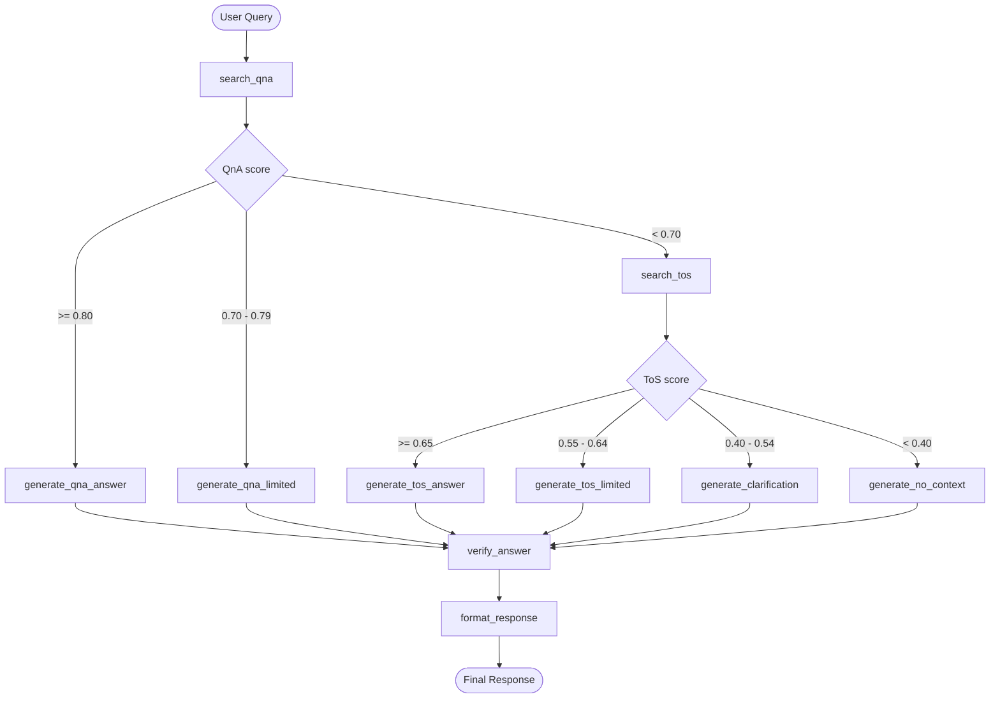

# Tiny Chatbot Agents

**Local LLM-based Customer Service Chatbot for Terms of Service (ToS) and QnA.**

This project implements a Retrieval-Augmented Generation (RAG) pipeline for customer inquiries. The runtime is now organized as a LangGraph state machine: it searches QnA first, falls back to Terms of Service (ToS) retrieval when QnA confidence is low, and optionally verifies ToS-grounded answers before returning them.

## 🌟 Key Features

-   **Graph-Orchestrated RAG Pipeline**: Uses LangGraph to compose search, generation, verification, and response formatting nodes.
-   **Dual-Stage Retrieval**: Prioritizes curated QnA matches before searching complex ToS documents.
-   **Hybrid Search**: Combines Vector Search (Semantic) with Rule-based matching and Knowledge Graph triplets for high precision.
-   **Advanced Ranking**: Uses **Bi-Encoder** (E5) for fast retrieval and **Cross-Encoder** (BGE-Reranker) for precise re-ranking.
-   **Hallucination Verification**: LLM-based verification step to ensure answers are grounded in the retrieved context.
-   **MCP Server Support**: Implements the [Model Context Protocol](https://modelcontextprotocol.io/) to integrate with Claude Desktop and other MCP clients.
-   **Local LLM Ready**: Designed to work with local inference servers (vLLM, Ollama) via OpenAI-compatible APIs.
-   **Robust Evaluation**: Integrated LLM-as-a-Judge framework with parallel execution and Korean-specific metrics.

## 🏗️ Architecture Overview


```mermaid
flowchart TD
    Start([User Query]) --> QnA["search_qna"]
    QnA --> QnARouter{"QnA score"}
    QnARouter -- ">= 0.80" --> QnAAnswer["generate_qna_answer"]
    QnARouter -- "0.70 - 0.79" --> QnALimited["generate_qna_limited"]
    QnARouter -- "< 0.70" --> ToS["search_tos"]

    ToS --> ToSRouter{"ToS score"}
    ToSRouter -- ">= 0.65" --> ToSAnswer["generate_tos_answer"]
    ToSRouter -- "0.55 - 0.64" --> ToSLimited["generate_tos_limited"]
    ToSRouter -- "0.40 - 0.54" --> Clarify["generate_clarification"]
    ToSRouter -- "< 0.40" --> Handoff["generate_no_context"]

    QnAAnswer --> Verify["verify_answer"]
    QnALimited --> Verify
    ToSAnswer --> Verify
    ToSLimited --> Verify
    Clarify --> Verify
    Handoff --> Verify

    Verify --> Format["format_response"]
    Format --> End([Final Response])
```

Notes:
- QnA mid-band requests now return a limited FAQ-based answer directly; they no longer probe ToS for a stronger fallback.
- Verification metadata is only attached for ToS `answer` and `limited_answer` responses when verification is enabled.

## 🚀 Getting Started

### Prerequisites

-   Python 3.11 or higher
-   [uv](https://github.com/astral-sh/uv) (recommended) or pip
-   (Optional) A running Local LLM server (e.g., vLLM, Ollama) or OpenAI API Key.

### Installation

1.  **Clone the repository:**
    ```bash
    git clone https://github.com/your-username/tiny-chatbot-agents.git
    cd tiny-chatbot-agents
    ```

2.  **Install dependencies using `uv`:**
    ```bash
    # Create virtual environment and install packages
    uv sync
    ```
    *Or using pip:*
    ```bash
    python -m venv .venv
    source .venv/bin/activate
    pip install -r requirements.txt
    ```

### Configuration

Configuration files are located in the `configs/` directory:

-   `agent_config.yaml`: Core agent settings (thresholds, LLM provider, search parameters).
-   `embedding_config.yaml`: Settings for embedding models (e.g., `multilingual-e5-large`) and rerankers.

## 💻 Usage

### 1. Running the Pipeline (CLI)

```bash
# Interactive mode
python main.py pipeline

# Single query
python main.py pipeline -q "계좌 해지 방법이 뭐야?"

# Search QnA / ToS databases directly (no LLM needed)
python main.py pipeline --search-qna "비밀번호"
python main.py pipeline --search-tos "제1조"
```

### 2. Web Interface (Streamlit)
To interact with the chatbot via a web interface:

```bash
python main.py streamlit
# or
streamlit run src/streamlit_app.py
```

This interface allows you to:
- Chat with the RAG pipeline.
- Search the QnA and ToS databases independently.
- Configure LLM providers and verification settings dynamically.

<p align="center">
  
  
  
</p>

### 3. Model Context Protocol (MCP) Server
To use this agent within Claude Desktop:

1.  **Run the MCP Server:**
    ```bash
    python main.py mcp
    ```

2.  **Configure Claude Desktop:**
    Add the following to your `claude_desktop_config.json`:
    ```json
    {
      "mcpServers": {
        "rag-chatbot": {
          "command": "/absolute/path/to/venv/bin/python",
          "args": ["-m", "src.mcp.server"],
          "cwd": "/absolute/path/to/tiny-chatbot-agents",
          "env": {
            "OPENAI_API_KEY": "sk-..."
          }
        }
      }
    }
    ```

### 4. Data Ingestion
Populate your vector databases with crawled data:

```bash
# Crawl data
python main.py crawl qna
python main.py crawl tos

# Ingest into Vector DB
python main.py ingest-qna
python main.py ingest-tos

# Run evaluation
python main.py evaluate --models "default" --report
```

## 📁 Project Structure

```
tiny-chatbot-agents/
├── configs/              # Configuration files (Agent, Embeddings)
├── data/                 # Data storage (VectorDB, Raw JSONs)
├── docs/                 # Documentation
├── main.py               # Unified CLI entry point
├── src/
│   ├── crawlers/         # Playwright-based web crawlers
│   ├── evaluation/       # LLM Judge evaluation framework
│   ├── graph/            # LangGraph nodes, routers, and graph state
│   ├── llm/              # LLM Client wrappers
│   ├── mcp/              # MCP Server implementation
│   ├── pipeline/         # RAGPipeline facade + shared response models
│   ├── tos_search/       # Hybrid search & Reranking logic
│   ├── vectorstore/      # ChromaDB wrappers
│   └── verifier/         # Hallucination verification logic
└── tests/                # Unit tests
```

## 🛠️ Tech Stack

-   **Vector DB**: [ChromaDB](https://www.trychroma.com/)
-   **Embeddings**: `intfloat/multilingual-e5-large` (Bi-Encoder)
-   **Reranking**: `BAAI/bge-reranker-v2-m3` (Cross-Encoder)
-   **LLM Interface**: OpenAI API compatible (vLLM/Ollama support)
-   **Workflow Orchestration**: `langgraph`, `langchain-core`
-   **MCP**: `fastmcp`
