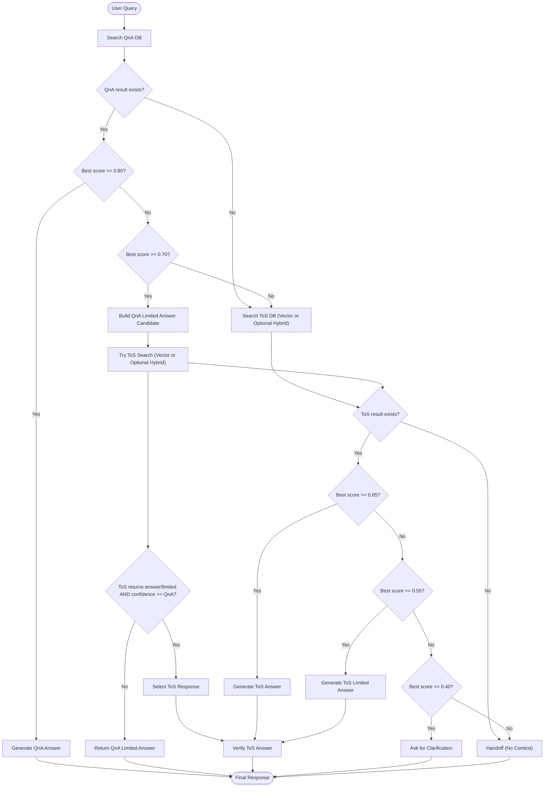

# RAG Architecture

The Request-Augmented Generation (RAG) pipeline is the core of this chatbot. It is designed to handle queries with varying levels of complexity, from simple FAQ lookups to complex interpretation of Terms of Service (ToS).

## Pipeline Strategy: QnA First, ToS Second

The pipeline (`src/pipeline/rag_pipeline.py`) follows a strict waterfall logic to ensure efficiency and accuracy.

### Flow Diagram

## Thresholds Configuration

The pipeline behavior is controlled by confidence thresholds in `RAGPipeline` (default values below; they may be overridden at initialization):

| Threshold | Default | Description |
| :--- | :--- | :--- |
| `qna_threshold` | **0.80** | Minimum similarity score to accept a QnA match. High to prevent wrong FAQ answers. |
| `tos_threshold` | **0.65** | Minimum score to consider a ToS section highly relevant. |
| `qna_mid_threshold` | **0.70** | Mid-band for QnA. If score is here, we return limited QnA unless ToS is better. |
| `tos_mid_threshold` | **0.55** | Mid-band for ToS. Used for limited-answer responses. |
| `tos_low_threshold` | **0.40** | Low-band for ToS. Used to trigger clarification. |
| `verification_threshold` | **0.70** | Minimum score used by the verifier when verification is enabled. |

## 1. QnA Stage (High Precision)
*   **Goal**: Instantly answer common questions.
*   **Mechanism**: Dense Vector Search (Cosine Similarity).
*   **Data Source**: `data/vectordb/qna` (ChromaDB).
*   **Logic**:
    *   **High Confidence (>= 0.80)**: Directly use the matched QnA to answer.
    *   **Mid Confidence (0.70 - 0.79)**: Check ToS. If ToS has a better match, use ToS. Otherwise, provide a "Limited Answer" based on the QnA, explicitly stating uncertainty.

## 2. ToS Stage (Deep Retrieval)
*   **Goal**: Answer complex questions based on legal text.
*   **Mechanism**: Vector Search by default, with optional Hybrid Search (Vector + Rule/Triplet) when enabled.
*   **Fallback**: If QnA fails (or is in mid-band with lower confidence), the system queries the ToS database.
*   **Logic**:
    *   **High Confidence (>= 0.65)**: Use retrieved sections to generate a definitive answer.
    *   **Mid Confidence (0.55 - 0.64)**: Generate a "Limited Answer" with a disclaimer about uncertainty.
    *   **Low Confidence (0.40 - 0.54)**: Return a "Clarification" response, asking the user for more specific details.
*   **Refinement**: In hybrid mode, additional scoring signals (rule/triplet and rerank-related scores) can be used.

## 3. Verification Stage
*   **Goal**: Prevent hallucinations.
*   **Component**: `src/verifier/verifier.py`.
*   **Process**: A separate LLM call compares the *Generated ToS Answer* against the *Retrieved ToS Context* to check factual consistency. (Current implementation verifies ToS responses; QnA responses are returned without verifier checks.)
