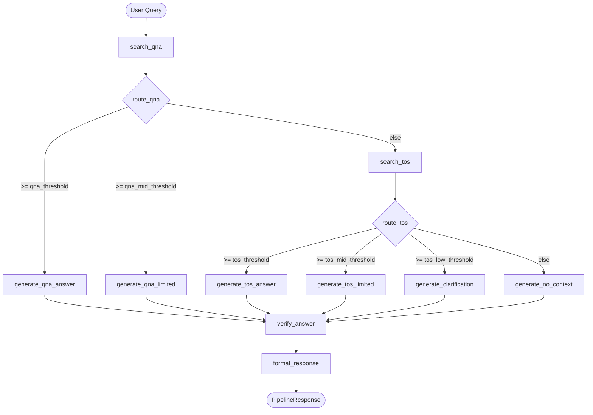

# RAG Architecture

The Retrieval-Augmented Generation (RAG) pipeline is the core of this chatbot. The current implementation keeps `RAGPipeline` as a thin facade and delegates orchestration to a LangGraph state machine under `src/graph/`.

## Runtime Layout

- `src/pipeline/rag_pipeline.py`: initializes stores, LLM, verifier, thresholds, and the compiled graph.
- `src/pipeline/models.py`: shared `PipelineResponse` and `ResponseSource` types.
- `src/graph/graph.py`: builds the state graph.
- `src/graph/state.py`: defines `GraphState`.
- `src/graph/nodes/*`: search, generation, verification, and formatting nodes.
- `src/graph/edges/routers.py`: threshold-based routing functions.

## Pipeline Strategy: QnA First, ToS Second

### Flow Diagram

```mermaid
flowchart TD
    Start([User Query]) --> SearchQnA["search_qna"]

    SearchQnA --> RouteQnA{"route_qna"}
    RouteQnA -- ">= qna_threshold" --> QnAAnswer["generate_qna_answer"]
    RouteQnA -- ">= qna_mid_threshold" --> QnALimited["generate_qna_limited"]
    RouteQnA -- "else" --> SearchToS["search_tos"]

    SearchToS --> RouteToS{"route_tos"}
    RouteToS -- ">= tos_threshold" --> ToSAnswer["generate_tos_answer"]
    RouteToS -- ">= tos_mid_threshold" --> ToSLimited["generate_tos_limited"]
    RouteToS -- ">= tos_low_threshold" --> Clarify["generate_clarification"]
    RouteToS -- "else" --> NoContext["generate_no_context"]

    QnAAnswer --> Verify["verify_answer"]
    QnALimited --> Verify
    ToSAnswer --> Verify
    ToSLimited --> Verify
    Clarify --> Verify
    NoContext --> Verify

    Verify --> Format["format_response"]
    Format --> End([PipelineResponse])
```

## Thresholds Configuration

The pipeline behavior is controlled by confidence thresholds in `RAGPipeline`:

| Threshold | Default | Description |
| :--- | :--- | :--- |
| `qna_threshold` | **0.80** | Minimum similarity score to accept a QnA match. |
| `qna_mid_threshold` | **0.70** | Mid-band for QnA. If the score is here, the graph returns a limited QnA answer directly. |
| `tos_threshold` | **0.65** | Minimum score to consider a ToS section highly relevant. |
| `tos_mid_threshold` | **0.55** | Mid-band for ToS. Used for limited-answer responses. |
| `tos_low_threshold` | **0.40** | Low-band for ToS. Used to trigger clarification. |
| `verification_threshold` | **0.70** | Minimum score used by the verifier when verification is enabled. |

## 1. QnA Stage

*   **Goal**: Instantly answer common questions.
*   **Mechanism**: Dense vector search over the QnA Chroma collection.
*   **Logic**:
    *   **High Confidence (>= 0.80)**: route to `generate_qna_answer`.
    *   **Mid Confidence (0.70 - 0.79)**: route to `generate_qna_limited`.
    *   **Low Confidence (< 0.70)**: fall back to ToS search.

The search node in `src/graph/nodes/search.py` normalizes QnA hits into dictionaries that include question, answer, category, sub-category, score, source, and source URL metadata.

## 2. ToS Stage

*   **Goal**: Answer complex questions grounded in policy and legal text.
*   **Mechanism**: Vector search by default, with optional hybrid search when `enable_hybrid_tos_search=True`.
*   **Fallback Rule**: ToS search only runs when QnA confidence is below `qna_mid_threshold`.
*   **Logic**:
    *   **High Confidence (>= 0.65)**: route to `generate_tos_answer`.
    *   **Mid Confidence (0.55 - 0.64)**: route to `generate_tos_limited`.
    *   **Low Confidence (0.40 - 0.54)**: route to `generate_clarification`.
    *   **Very Low Confidence (< 0.40)**: route to `generate_no_context`.

When hybrid search is enabled, the search node normalizes `final_score`, `combined_score`, rerank output, matched keywords, and matched triplets into state metadata. Explicit section references such as `제1조` are extracted from the query and stored in `state.section_reference`.

## 3. Verification Stage

*   **Goal**: Prevent hallucinations.
*   **Component**: `src/verifier/verifier.py`.
*   **Execution Rule**: The graph always visits `verify_answer`, but the node is a no-op unless verification is enabled and the response source is ToS with mode `answer` or `limited_answer`.
*   **Outputs**: `verified`, `verification_score`, `verification_issues`, and `metadata["verification_reasoning"]`.

QnA answers, clarifications, and handoff responses skip verifier execution.

## 4. Public API Notes

`RAGPipeline.query()` returns a `PipelineResponse` assembled from the final `GraphState`.

`RAGPipeline.search_qna()` and `RAGPipeline.search_tos()` remain available as direct search helpers. Both now accept either `n_results` or the alias `top_k`.
